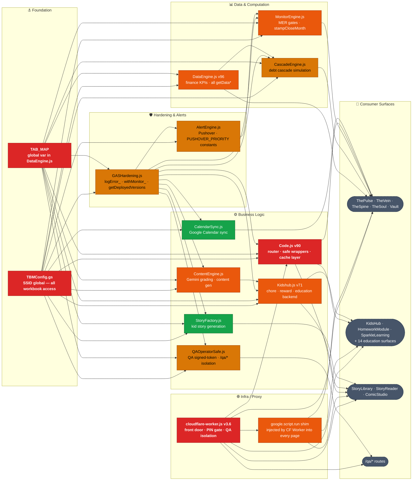

# TBM Dependency / Blast Radius Map — CP-2
<!-- control-plane v1 — sourced from Code.js v90, DataEngine.js v96, Kidshub.js v71, cloudflare-worker.js v3.6, CLAUDE.md File Map -->
<!-- update this file in every PR that changes a component's feeds, dependencies, or shared state (Work Doctrine rule 14) -->
<!-- DIAGRAM SYNC RULE: the Mermaid flowchart below and the tables below it must be updated together — any PR that changes a Feeds/Depends-On relationship must update both (Work Doctrine rule 14) -->

## Blast Radius Flowchart



**Blast radius key:** 🔴 Very High — 🟠 High — 🟡 Medium — 🟢 Low — ⬛ Consumer surface (leaf)

> **How to read this:** Find your component, follow the arrows to see what breaks downstream. Red/orange nodes = verify all downstream routes after any change.

---

## Server-Side Components

| Component | Feeds | Depends On | Shared State Risk | Blast Radius | If Touched, Re-Verify |
|---|---|---|---|---|---|
| **Code.js v90** (Router + safe wrappers + cache layer) | ALL surfaces (every doGet route, every safe wrapper call) | DataEngine.js (TAB_MAP, all getData* fns), Kidshub.js (all KH fns), GASHardening.js (logError_, withMonitor_), AlertEngine.js (sendPush_) | DE_CACHE_KEY (read/write), KH_CACHE_KEY (read/write), KH_CACHE_HB_KEY, SSID (from TBMConfig.gs), getEnvCacheKey_ QA scoping | **Very High** — failure = all surfaces return 500 | ALL routes 200; `?action=runTests` smoke PASS; all safe wrappers in shim FNS list present in Code.js |
| **DataEngine.js v96** (Finance KPI computation) | ThePulse, TheVein, TheSpine, TheSoul, Vault (getAllVaultData), getDeployedVersionsSafe (via GASHardening delegation) | TAB_MAP (all finance tabs), Transactions, Budget_Data, Balance History, Debt_Export, DebtModel, BankRec, Budget_Rules, WCM | DE_CACHE_KEY (via Code.js setCachedPayload_), _deCache (request-scoped), _deSS (workbook ref) | **High** — finance surfaces blind; ambient displays break | getDataSafe Logger output; ThePulse renders; TheVein renders; getDeployedVersionsSafe returns all versions |
| **Kidshub.js v71** (KH chore/reward/education backend) | KidsHub (Buggsy/JJ/Parent), HomeworkModule, SparkleLearning, WolfkidCER, reading-module, writing-module, fact-sprint, investigation-module, daily-missions, BaselineDiagnostic, ComicStudio, DesignDashboard, JJHome, ProgressReport, StoryLibrary, StoryReader, wolfkid-power-scan | KH_TABS (all KH_* sheet tabs via TAB_MAP), Curriculum tab, Helpers!Z1 (heartbeat), ContentEngine.js (getTodayContent_ called internally), GASHardening.js | KH_CACHE_KEY (read/write via Code.js), KH_CACHE_HB_KEY, KH heartbeat write after every mutation (stampKHHeartbeat_) | **High** — all kid + education surfaces broken; parent view broken | /buggsy renders chore board; /jj renders sparkle stars; /parent renders approval queue; getTodayContentSafe('buggsy') returns correct question shape; runTests smoke PASS |
| **ContentEngine.js** (Gemini grading + content generation) | Kidshub.js (getTodayContent_ calls ContentEngine internally), education surfaces via KH pipeline | Curriculum tab, KH_Education tab, Gemini API (LanguageApp / UrlFetchApp), GASHardening.js | Curriculum reads (shared with CurriculumSeed.js), KH_Education writes | **High** — getTodayContent returns empty or malformed → HomeworkModule/SparkleLearning render 'undefined' | getTodayContentSafe('buggsy') shape: question, options, answer, teks, id, difficulty all present; getTodayContentSafe('jj') same |
| **DataEngine.js — TAB_MAP** (global var in DataEngine.js, shared scope) | ALL .gs files that call getSheetByName() | Actual sheet tab names in the TBM spreadsheet | Global scope — any file redeclaring var TAB_MAP would shadow it | **Very High** — wrong tab name = silent null sheet = data reads fail with no error | Smoke PASS; grep confirms zero `var TAB_MAP` outside DataEngine.js |
| **GASHardening.js** (Error/perf logging + version reporting) | All .gs files via logError_, logPerf_, withMonitor_, getDeployedVersions() | ErrorLog tab, PerfLog tab (via TAB_MAP) | ErrorLog writes, PerfLog writes (non-blocking) | **Medium** — failure is non-fatal; all callers wrap in try/catch; surfaces degrade gracefully | Smoke PASS; getDeployedVersionsSafe returns all expected version numbers |
| **AlertEngine.js** (Pushover push notifications) | MonitorEngine.js, EducationAlerts.js, Tbmsmoketest.js, AuditTrigger.js, GASHardening.js error paths | PUSHOVER_TOKEN, PUSHOVER_USER_LT, PUSHOVER_USER_JT (Script Properties — Alertenginev1.js:47-49), Pushover API | PUSHOVER_PRIORITY constants (shared, used by all callers) | **Medium** — alerts broken, surfaces unaffected | Test push fires to LT phone; PUSHOVER_PRIORITY constants unchanged (grep); no bare integer priority args introduced |
| **CascadeEngine.js** (Debt cascade simulation) | TheVein (simulation feature only) | Debt_Export tab, DebtModel tab, DataEngine output | None (read-only) | **Medium** — TheVein simulation slider broken; rest of TheVein unaffected | TheVein renders; cascade simulation returns data; no ErrorLog entries |
| **MonitorEngine.js** (MER gates + month-end close) | TheVein (MER gate display), ThePulse (gate status), stampCloseMonth workflow | QA_Gates tab, Close History tab, AlertEngine.js | Close History writes, Month-End Review writes | **High** — month-end close workflow blocked | getMERGateStatusSafe returns gate statuses; runMERGatesSafe executes without error; stampCloseMonthSafe writes Close History row |
| **StoryFactory.js** (Gemini kid story generation) | StoryLibrary, StoryReader, ComicStudio | KH_StoryProgress tab, Gemini API, GASHardening.js | KH_StoryProgress writes | **Low** — story features broken; core KH chore/education unaffected | runStoryFactorySafe returns story; listStoredStoriesSafe returns list |
| **QAOperatorSafe.js** (QA route isolation + signed token) | /qa/* routes via CF Worker | QA_HMAC_SECRET (Script Property), TBM_QA_SSID (Script Property), QA_Snapshots tab | QA_Snapshots writes; QA-scoped cache keys via getEnvCacheKey_ | **Medium** — QA mode broken; prod unaffected | /qa/homework returns 200 with QA amber banner; QA token validation passes |
| **CalendarSync.js** (Google Calendar sync) | TheSpine (calendar event display) | Google Calendar API, GASHardening.js | None (writes to Calendar, reads for display) | **Low** — calendar display on TheSpine broken; everything else unaffected | Calendar events display on TheSpine |
| **TBMConfig.gs** (Environment-aware SSID) | ALL .gs files (SSID is global) | TBM_ENV Script Property, prod/QA SSID constants | SSID global var — reassigned per-request in QA mode (Code.js serveData) | **Very High** — wrong SSID = wrong workbook = all data reads broken | grep confirms `var SSID` declared only in TBMConfig.gs; openById(SSID) pattern in all sheet reads |

## Client-Side / Proxy Components

| Component | Feeds | Depends On | Shared State Risk | Blast Radius | If Touched, Re-Verify |
|---|---|---|---|---|---|
| **cloudflare-worker.js v3.6** (Smart proxy + PIN gate + QA isolation) | ALL surfaces (front door for all requests to thompsonfams.com) | GAS_URL (hardcoded deploy URL), FINANCE_PIN (CF env secret), QA_HMAC_SECRET (CF env secret), PIN_RATE_LIMITER (CF binding) | finance cookie (tbm_auth, 24h), QA cookie (tbm_qa, 4h), PATH_ROUTES + QA_ROUTES mapping tables | **Very High** — proxy down = all surfaces unreachable | All PATH_ROUTES curl 200; /version returns build ID; PIN gate sets cookie; /api proxy returns JSON; /qa/* routes return QA banner |
| **google.script.run shim** (injected by cloudflare-worker.js into every served page) | All HTML surfaces that call `google.script.run.<fn>()` | /api endpoint (POST), FNS list in shim must match safe wrappers in Code.js | FNS array in shim — if a Safe wrapper is added to Code.js but not to FNS, calls fail silently | **High** — missing function in FNS → client-side calls never fire | Grep: every `google.script.run.`callsite in .html has matching entry in FNS array in cloudflare-worker.js |

## Cache Key Registry

| Key | Owner | TTL | Scope | Bust trigger |
|---|---|---|---|---|
| `DE_PAYLOAD` | Code.js setCachedPayload_ | 900s (15 min) | Prod or `qa:DE_PAYLOAD` | bustCache() or TTL expiry |
| `KH_PAYLOAD` | Code.js setCachedKHPayload_ | 60s | Prod or `qa:KH_PAYLOAD` | Heartbeat mismatch or TTL |
| `KH_LAST_HB` | Code.js setCachedKHPayload_ | 60s | Prod or `qa:KH_LAST_HB` | Any KH write (stampKHHeartbeat_) |
| `KH_PAYLOAD_buggsy` | Code.js per-child KH cache | 60s | Prod or `qa:*` | Heartbeat mismatch or TTL |
| `KH_PAYLOAD_jj` | Code.js per-child KH cache | 60s | Prod or `qa:*` | Heartbeat mismatch or TTL |

## Safe Wrapper Chain (Code.js)

Every client-callable function follows this pattern:
```
<fn>Safe() → withMonitor_(<fn>Safe) → lock (waitLock 30000) → delegate to module → return JSON
```
- `withMonitor_` = GASHardening.js performance wrapper + error logger
- All wrappers use `waitLock(30000)`, never `tryLock()`
- Failure path: returns `{ error: '...' }` JSON (never throws to client)

## TAB_MAP Read/Write Ownership

| Tab group | Owner (writes) | Readers |
|---|---|---|
| Finance tabs (Transactions, Budget_Data, Balance History, etc.) | Tiller Money (external sync) | DataEngine.js |
| Dashboard_Export, Debt_Export, DebtModel, Cascade* | DataEngine.js | ThePulse, TheVein renders |
| KH_Chores, KH_History, KH_Rewards, KH_Redemptions, KH_Requests, KH_ScreenTime, KH_Grades | Kidshub.js | KidsHub, ProgressReport |
| KH_Education | Kidshub.js (via ContentEngine.js) | HomeworkModule, SparkleLearning, all education surfaces |
| KH_MissionState | Kidshub.js | daily-missions |
| KH_PowerScan | Kidshub.js | wolfkid-power-scan |
| KH_StoryProgress | StoryFactory.js | StoryLibrary, StoryReader, ComicStudio |
| KH_LessonRuns, KH_VocabExposures | Kidshub.js | SparkleLearning (JJ lesson run contract) |
| Curriculum | CurriculumSeed.js (seed only) | Kidshub.js, ContentEngine.js |
| ErrorLog, PerfLog | GASHardening.js | Monitoring / alerts |
| Close History | MonitorEngine.js | TheVein close workflow |
| QA_Gates | MonitorEngine.js | TheVein MER display |
| QA_Snapshots | QAOperatorSafe.js | QA Operator |
| Helpers (Z1 heartbeat) | Kidshub.js stampKHHeartbeat_ | Code.js KH cache invalidation |
