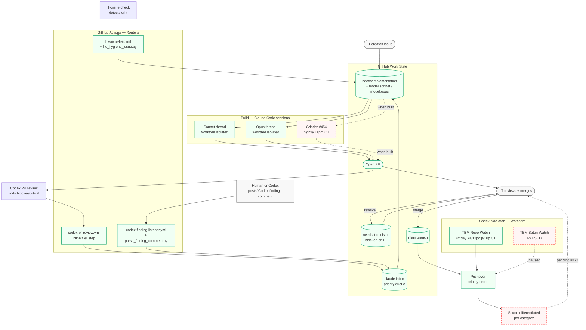

# TBM Automation Flow — High-Level Process Map

> How work gets into the repo, how it gets built, how you get alerted.
> Dashed nodes = not built yet. See Gap Register below for issue links.

## Legend

| Style | Meaning |
|---|---|
| solid green | Live and working today |
| dashed red | Not built yet — see Gap Register |
| grey | Human action (LT) |

## Gap Register — unbuilt pieces

| Gap | Blocked on | Impact |
|---|---|---|
| **Grinder** — nightly Claude Code executor that drains `model:opus` + `needs:implementation` | [#454](https://github.com/blucsigma05/tbm-apps-script/issues/454) in flight | Work queue doesn't drain automatically; every build requires a manual session |
| **Sound differentiation** — one recognizable sound per alert category | [#472](https://github.com/blucsigma05/tbm-apps-script/issues/472) filed | Phone rings indistinguishably; LT must check banner to see what fired |
| **TBM Baton Watch** | Paused — re-enable when actively in a Codex baton thread | None; paused on purpose |

## What this map is for

- Before adding a new automation, check whether it duplicates a live node
- When a new gap is identified, file an Issue and re-render this diagram
- This is CP-3 in the control-plane system — update when flows change (work-doctrine rule 14 applies)

## Related diagrams

- [two-lane-model.md](two-lane-model.md) — house/contractor diagram for the builder vs. auditor lanes
- [../dependency-map.md](../dependency-map.md) — code-architecture blast-radius table (Mermaid upgrade pending in [#471](https://github.com/blucsigma05/tbm-apps-script/issues/471))
