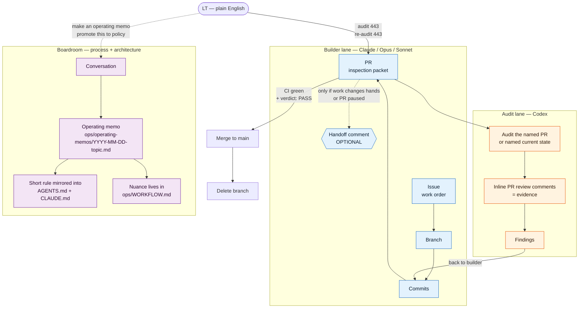

# TBM Two-Lane Model

Visual companion to `ops/WORKFLOW.md § Two-Lane Handoff Rules`. Rendered natively on GitHub — no external tooling.

## Diagram

## Legend (house + contractor model)

- **Repo** = the house. One shared address (`C:\Dev\tbm-apps-script`).
- **Branch** = a hallway in the house. You can walk into one without blocking anyone else.
- **Commit** = a progress photo of the hallway at one moment. Cheap, reversible, additive.
- **PR** = an inspection packet handed to the auditor. Has a defined scope — the named hallway, not the whole house.
- **Merge** = work accepted into the main house. Main is the canonical state everyone else walks into.
- **Handoff comment** = the sticky note on the inspection packet saying "I stopped here, you pick up next." Optional. Only used when the packet actually changes hands mid-flight.
- **Operating memo** = the boardroom minutes. Persists decisions that would otherwise live only in chat.

## Plain-English command contract

See `ops/WORKFLOW.md § Two-Lane Handoff Rules` for the full command table and trigger phrases. This diagram is navigation — the rules themselves live there.
